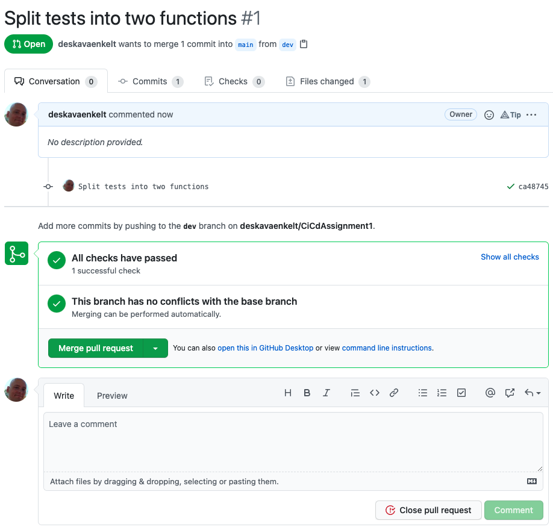

# CI/CD Assignment 1

# Table of Content

- [Assignment 1](#assignment-1)
    - [What to evaluate](#what-to-evaluate)
    - [Introduction](#introduction)
- [Report](#report)
    - [Installation requirements](#installation-requirements)
    - [Initial test setup](#initial-test-setup)
        - [Python](#python)
        - [CircleCI setup](#circleci-setup)
    - [CircleCI Web setup](#circleci-web-setup)
    - [Dev branch](#dev-branch)
    - [Github pull request](#github-pull-request)
    - [Report requirements](#report-requirements)
    - [](#)
    - [](#)
    - [](#)
- [](#)

# Assignment 1

## What to evaluate

After completing the course, the student should be able to:

**Knowledge:**

1. Explain the different parts of Continuous Integration
2. Describe testing and device testing in the area
3. Explain CI/CD

**Skills:**

4. Use processes and methods for applying Continuous Integration

## Introduction

This assignment consists of two parts. With this assignment, you must write a report in which you document how you have
thought through the practical steps.

The goal of the assignment is to start a CI chain with the help of various tools before the deadline 7 May at 23:55

**Requirement:**

Create a python application with either Flask or any code that can be found on Github. This repo should have two
branches; **main**, **dev**

There must be at least two unit tests and one lint installed

A CI tool will be implemented to help us with our pull requests

All development takes place towards the dev industry and must be merged into the main with the help of a manual pull
request. This must be done regularly, ie as soon as something new has been implemented.

- Github
- CircleCI
- Python
- Pytest
- Flake8

**Report requirements:**

- The report must contain the tools you worked with
- How you used them during the task
- If you encountered any obstacles and how you solved them
- Describe how tests work and how you have used them in your task
- Explain what is missing for to achieve CD

# Report

## Installation requirements

I start by creating a Git Repo for the assignment and then create a Python projekt with PyCharm

```shell
pip install flake8
pip install pytest
pip install pytest-cov
```

[Change default test runner in PyCharm to pytest](https://www.jetbrains.com/help/pycharm/pytest.html#enable-pytest)

**flake8 settings in PyCharm**


## Initial test setup

### Python

I create a `main.py` and `test_main.py` to verify that my test setup is working.

`main.py` contain:

```python
def addition(x, y):
    return x + y

```

`test_main.py` contain:

```python
import main


def test_addition():
    assert main.addition(2, 2) == 4
    assert main.addition(2, 2) != 3

```

Coverage test:

```shell
pytest --cov=app
```

### CircleCI setup

Create a `requirements.txt`

```shell
pip3 freeze > requirements.txt # generate from venv
cat requirements.txt
```

**output:**

```text
attrs==20.3.0
flake8==3.9.1
iniconfig==1.1.1
mccabe==0.6.1
packaging==20.9
pluggy==0.13.1
py==1.10.0
pycodestyle==2.7.0
pyflakes==2.3.1
pyparsing==2.4.7
pytest==6.2.3
pytest-cov==2.11.1
toml==0.10.2
```

Cleanup of `requirements.txt`

```text
flake8==3.9.1
py==1.10.0
pytest==6.2.3
pytest-cov==2.11.1
```

Create a `.circleci` folder

```shell
mkdir .circleci
cd .circleci
touch config.yml
```

Open config.yml and enter configuration

```yaml
version: 2
jobs:
  build:
    docker:
      - image: circleci/python:3.9

    working_directory: ~/repo

    steps:
      # Step 1: obtain repo from GitHub
      - checkout
      # Step 2: create virtual env and install dependencies
      - run:
          name: install dependencies
          command: |
            pip install -r requirements.txt
      # Step 3: run linter and tests
      - run:
          name: run tests
          command: |
            flake8 --exclude=env* --statistics
            pytest -v
```

This is the basic setup I'm going to start building with. So I commit and push to my git repo from here

## CircleCI Web setup

Log in to CircleCI and setup project:


Start building:


Success on first run:


Test log:


## Dev branch

Split the single test into two tests in dev branch.

From:

```python
import main


def test_addition():
    assert main.addition(2, 2) == 4
    assert main.addition(2, 2) != 3
```

To:

```python
import main


def test_addition1():
    assert main.addition(2, 2) == 4


def test_addition2():
    assert main.addition(2, 2) != 3
```

Commit and push:


## Github pull request

Now we will merge `dev` into `main` if the tests are `OK`: 


Create pull request:


Merge pull request:



Successful merge:


## Report requirements:

1. The report must contain the tools you worked with [x]
2. How you used them during the task [x]
3. If you encountered any obstacles and how you solved them. [x]
    - I use PyCharm, so I had to configure my IDE a little different.
    - When I created the project it was initiated with a `__init__.py` that give som problems with my tests when its
      empty. Initially I solved the problem by deleting the file.
4. Describe how tests work and how you have used them in your assignment
5. Explain what is missing to achieve CD (Continuous Delivery)
